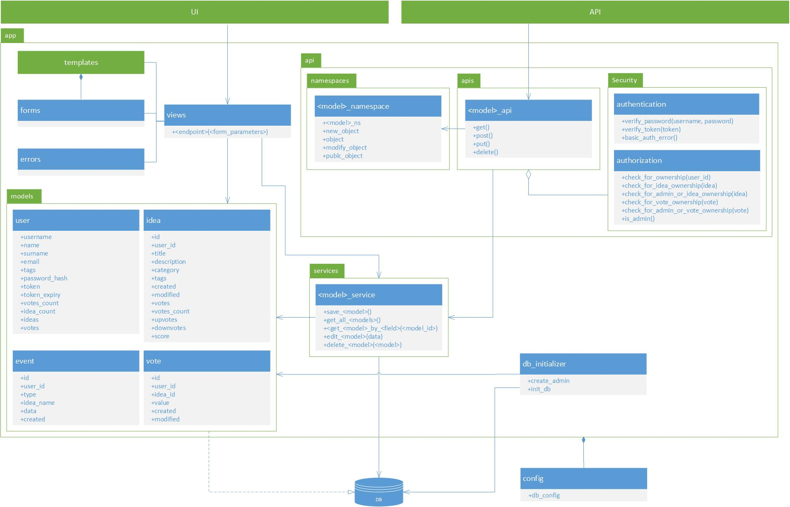

# IdeaHub
[](https://travis-ci.com/boceckts/ideahub)
[](https://codecov.io/gh/boceckts/ideahub)

2019 [CITS5505](http://teaching.csse.uwa.edu.au/units/CITS3403/index.php?fname=projects&project=yes) Agile Web Development Practical Project

#### Authors:
- [Tobias Boceck](https://github.com/boceckts)
- [Noah Lester](https://github.com/njlester)

ToC:
1. [Main Idea](#main-Idea)
2. [Features](#features)
3. [Concept](#concept)
4. [Used Libraries](#used-libraries)
5. [Architecture](#architecture)
6. [Development](#development)
    1. [Clone The Project](#clone-the-project)
    2. [Install Virtual Environment](#install-virtual-environment)
    3. [Initialize and Migrate new Database Schema](#initialize-and-migrate-new-database-schema)
    4. [Database Initialization](#database-initialization)
        1. [Create Admin User](#create-admin-user)
    5. [Start the Web Application](#start-the-web-application)
    6. [Run Tests](#run-tests)
        1. [Test Coverage](#test-coverage)
        2. [Manual Tests](#manual-tests)
    7. [Update Python Requirements](#update-python-requirements)
    8. [Docker](#docker)


## Main Idea:
A platform where users can submit, manage, share, explore and vote on ideas.

## Features
- Submit and manage your ideas
- Explore ideas from other users
- Get inspired by automatically being presented with ideas you might be interested in
- Vote on any idea
- See rankings of the best, worst, hottest and most trendy ideas
- Keep track of how popular your ideas are
- Developer REST API

## Concept
Users are presented with a promoting page first and are asked to login or sign up.
Without logging in, only the **Leaderboard**, the promoting, **Sign Up** and **Login** pages should be present.
Users can sign up or login to access the web application.
<br>The user's **Home** page includes a dashboard of the user's activity and suggests the user what he might want to do next.
<br>The user can discover any idea by using the **Explore** page and setting some filter criteria.
<br>Clicking on any idea title opens up the **Idea** view where the user can see the details of the selected idea and the user can now also vote on the idea.
<br>The top bar of the idea shows the score (upvotes - downvotes) of the idea, the total vote count, upvotes and downvotes.
If the idea has been created by the user this view shows additional controls to edit or delete the idea.
<br>The URL of the **Idea** can also be used to easily share an idea with others.
<br>The **Inspire Me** page recommends an idea to the user by matching the users interests (from the user profile) with the tags of an idea.
<br>The **Activity** page displays a news feed of what happens to your ideas and the ideas you voted on.
Events are generated whenever an idea reaches a certain amount of upvotes or total votes and whenever and idea that you voted on has been changed or deleted.
<br>The **Leaderboard** page shows the top 10 ideas in their respective ranking category.
The score is calculated by subtracting the downvotes from the upvotes of an idea.
An idea can be viewed in more detail by clicking on its title.
<br>The **My Profile** page lists all the ideas that the user created and provides a way to change the user's details and their interests or to delete a the profile.
<br>In order to create a new idea we added a **Create Idea** button to the navigation bar that is always visible when logged in.
<br>Additionally, a admin view can be accessed when logging in as an admin.
It includes a list of **Users** and a list of **Ideas** where the admin can delete individual entries.
Clicking on the show votes button of an idea entry lists all the votes of an idea where the admin can also delete individual votes of that particular idea.
<br>Additionally, a REST API should support all the features and includes a documentation that is automatically being generated and hosted on `/api/v1/docs`.

## Used Libraries
This project solely uses open source libraries and frameworks wih a [3-Clause BSD](https://opensource.org/licenses/BSD-3-Clause) or [MIT](https://opensource.org/licenses/MIT) License.
The project is based on python and flask and uses the following flask libraries and any of their dependencies.
- [Flask](http://flask.pocoo.org/)
- [Flask-Bootstrap](https://pythonhosted.org/Flask-Bootstrap/)
- [Flask-HTTPAuth](https://flask-httpauth.readthedocs.io/en/latest/)
- [Flask-Login](https://flask-login.readthedocs.io/en/latest/)
- [Flask-SQLAlchemy](https://flask-sqlalchemy.palletsprojects.com/en/2.x/)
- [Flask-Migrate](https://flask-migrate.readthedocs.io/en/latest/)
- [Flask-WTF](https://flask-wtf.readthedocs.io/en/stable/)
- [flask-restplus](https://flask-restplus.readthedocs.io/en/stable/)
- [flask_moment](https://github.com/miguelgrinberg/flask-moment/)

Additionally we use the javascript library [chart.js](https://www.chartjs.org/).
Some parts of our code are based on the snippets that these libraries provide in their official developer reference.

## Architecture
The following diagram visualizes the architecture of our application.
We followed the principle that all the database communication should only be done by using the respective services.
The database initializer is an exception to this rule as it includes commands that are exposed to the flask cli.
View and API should also not interfere or call each other.
While the view uses the internal model directly our API uses models from its own namespaces to easily marshall and un-marshall response and request objects.
The endpoints of our api use a security module which is responsible to determine whether or not users are allowed to access a particular resource.
The view uses forms and templates to create the user interface.



## Development
In order to contribute to this project you need to set up your local development environment.
The following steps need to performed in your terminal and require Python 3.x to be installed.

Install the python virtual environment packages by opening a **terminal** **(Linux/Mac)** or **command prompt** **(Windows)** and typing the following commands.
```
pip3 install virtualenv
```

### Clone the Project
Get the project code on your local computer to start developing.

1. Clone the git project

    with **ssh**
    ```
    git clone git@github.com:boceckts/ideahub.git
    ```
    or else with **https**
    ```
    git clone https://github.com/boceckts/ideahub.git
    ```

2. change into the newly created directory
    ```
    cd ideahub
    ```

### Install Virtual Environment
Inside the project folder create a virtual environment for the flask project and install all required dependencies for this project.

1. Create a folder for a virtual environment
    ```
    python -m venv flask
    ```

2. Activate your virtual environment

    on **Windows**
    ```
    flask\Scripts\activate
    ```
    - if you need to deactivate the virtual environent use
        ```
        flask\Scripts\deactivate
        ```
    or else on **Linux/Mac**
    ```
    source flask/bin/activate
    ```
    - if you need to deactivate the virtual environent just type
        ```
        deactivate
        ```

3. Install all requirements to run the project

    on **Windows**
    ```
    pip install -r requirements.txt
    ```
    or else on **Linux/Mac**
    ```
    pip install -r requirements.txt
    ```

### Initialize and Migrate new Database Schema
from within your virtual environment run the following scripts to init, migrate and upgrade your database.
1. Create a database
    ```
    flask db init
    ```
2. Migrate the database
    ```
    flask db migrate
    ```
3. Upgrade the database to use the latest table definitions
    ```
    flask db upgrade
    ```

### Database Initialization
We have added a database initialization command to flask that allows us to initialize the database with example data for demonstration and testing purposes.
This will make the following list of users available `users = ["Initial","Liam","William","James","Logan","Benjamin","Mason","Elijah","Oliver","Jacob","Lucas","Michael","Alexander","Ethan","Daniel","Matthew","Aiden","Henry","Joseph","Jackson","Samuel","Sebastian","David","Carter","Wyatt","Jayden","John","Owen","Dylan","Luke","Gabriel","Anthony","Isaac","Grayson","Jack","Julian","Levi","Christopher","Joshua","Andrew","Lincoln","Mateo","Ryan","Jaxon","Nathan","Aaron","Isaiah","Thomas","Charles","Caleb"]`.
Each user is created with a username consisting of their name in lower case followed by a `1` with the password `123456`.

E.g. username `logan1`, password `123456`.

If you need to initialize the database, type the following command from within your virtual environment.
```
flask init-db
```

## Create Admin User
An admin user can be created by typing the following command inside a terminal or command prompt inside your virtual environment.
This will also overwrite any existing admin user.
Without setting the environment variable `ADMIN_PWD` the admin user will be created with the default password `123456`.
```
set ADMIN_PWD=<admin-password>
flask create-admin
```

### Start the Web Application
Run the flask web application on your localhost by either using the **Windows** command prompt or the terminal on **Linux/Mac**.
from within your virtual environment run the following commands to start your flask application.

on **Windows**
```
set FLASK_APP=app
set FLASK_ENV=development
flask run
```
or else on **Linux/Mac**
```
export FLASK_APP=app
export FLASK_ENV=development
flask run
```

The web application should now be up and running at http://127.0.0.1:5000/ (or http://localhost:5000/).
The documentation of the REST API of the application will be available on http://127.0.0.1:5000/api/v1/docs.

### Run Tests
The project includes a `test` directory where any automated tests are located.
The following test packages are present
1. `unit` - all unittests
2. `unit.model` - unittests for our models
3. `unit.service` - unittests for our database services
4. `integration` - all integration tests
5. `integration.api` - integration tests for our api endpoints

In order to run them we use the unittest command of python.
Type the following commands within your virtual environment to run
all tests
```
python -m unittest discover -s test -p "*_tests.py" -v
```
specific unittests
```
python -m unittest discover -s test.<package>[.<module_name>] -p "*_tests.py" -v
```


#### Test Coverage
In order to see the test coverage of the project we can install and use the package `coverage` by typing `pip install coverage` into a terminal within your virtual environment.
Use the following commands to generate a test coverage report which can be viewed by opening the [index](htmlcov/index.html) file in a browser.
```
coverage run --source=app -m unittest discover -s test -p "*_tests.py" -v
coverage html
```
Alternatively you can also view the report right in the terminal by using the command `coverage report -m`.

#### Automated System Tests
Selenium was used to automate the system tests using Google Chrome. It can be run using:
```
python selenium_testing.py
```
Note: The file 'chromedriver.exe' is required to be in the same folder as the python script when run.


#### Manual Tests
In addition to the automated test, we created a postman collection `IdeaHub.postman_collection.json` in order to manually testing scenarios and use cases.

### Update Python Requirements
If you need to install new python packages or update existing ones, do so within your virtual environment.
Afterwards run the following command in a command prompt or terminal from within your virtual environment to ensure the new requirements will be versioned and available to others.
```
pip freeze > requirements.txt
```

### Docker
A dockerfile is available which can be used to quickly create a production container of the app.
For demonstration purposes we also initialize and fill the database inside the container with sample data.
In order to manually start the application in production mode you need to set the environment variable `FLASK_ENV=production` and pass `--host=0.0.0.0` as command args to the flask `run` command.
This will be automatically done by the docker container which can be build and run by typing the following commands in a command prompt or terminal.
```
docker build --build-arg ADMIN_PWD=<admin-password> -t ideahub:latest .
docker run --name ideahub -p 5000:5000 ideahub:latest
```
